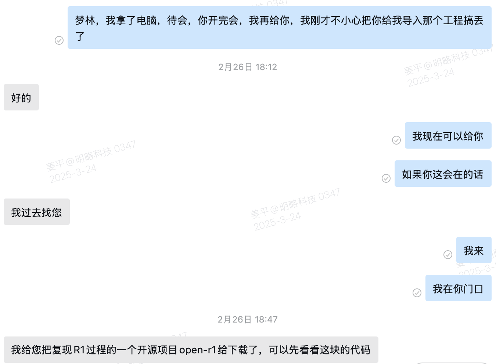
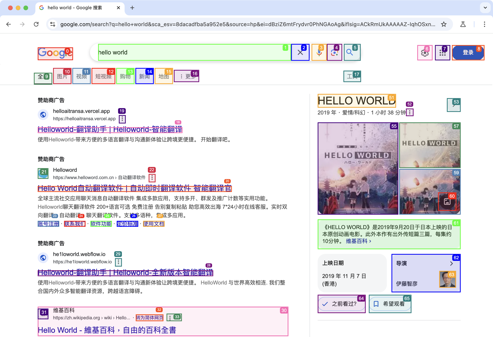
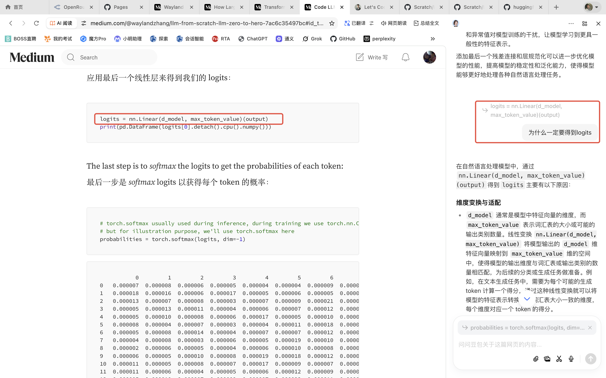

# From zero to ...

## 背景故事
手搓大模型：我正在跟手搓大模型的 kol/koc 学习。传言的版本是我已经能够手搓大模型。我现在还不能手搓大模型，只能说刚刚入门。

## 一、学习阶段
### 1、纯学习
#### 不自量力
2 月 26 日，装了 VS Code，梦林帮我下载了 [open-r1](https://github.com/huggingface/open-r1)，梦林太看起我了，我啥都看不懂，无从下手。


#### 学习教程
还是从头开始学习吧，没有捷径。我看过一些论文，但是觉得理解起来很费劲，我想我还是从简单的入手吧。我上 bilibili 上 找了好多视频学习，很多都太散，不系统。有的是讲论文的，我的基础打的不扎实，我听的似懂非懂的，我只是知道了个概念和大概原理，可能能出去忽悠，对我个人的真知帮助没那么大。有的是灌水课的，没有知识量，只有盗取过来的宣传信息，看了基本等于白看。这个张老师的课，我个人觉得深入潜出，靠谱，不仅仅给你讲背后的道理，还手把手教你怎么手搓大模型，真正的理论和实践结合，知行合一才是真知。值得推荐给大家（我在不同的渠道费了好大劲找到了视频、博客和代码之间的关系，有的博客是我在代码里看到的地址）。
* 视频
    * [LLM张老师](https://www.bilibili.com/video/BV1JBPkeQEj9/?spm_id_from=333.999.0.0&vd_source=2c0f76983c4f568a4018e92a42a85e94)
* 博客
    * [Wayland Zhang](https://medium.com/@waylandzhang/llm-from-scratch-llm-zero-to-hero-7ac6c35497bc)
    * [LLM: From Zero to Hero](https://waylandzhang.github.io/en/let-s-code-llm.html)
* 代码
    * [Transformer-from-scratch](https://github.com/waylandzhang/Transformer-from-scratch)

### 2、学习使用工具
#### 1）IDE
* IntelliJ IDEA
* VS Code + github copilot
* Trae-CN
* Trae
* Cursor

备注：
我学习了 MGX 和 Devin，确认不是自己想要的，或者说不适合工程师。

#### 2）Github
##### - Git 命令
```bash
git clone https://huggingface.co/bytedance-research/UI-TARS-7B-DPO
git clone https://github.com/browser-use/browser-use

git init
--这一步注意不能提交大文件，比如对于模型文件要创建 .gitignore 或者直接删除模型文件后再提交。我被这个错误坑了 3 天，就是不知道我的代码为什么提交不上去，是我的网络问题，还是我的环境变量配置问题，还是我的命令问题。原来超过 100M 的文件不能提交到 github 上。

git add .
git commit -m "更新项目内容"
git remote add origin https://github.com/jiangpingT/Scratch.git
git branch -M main
git push -u origin main
git pull origin main
git push origin main
```
##### - 我的github基本信息
我的主页：[jiangpingT](http://github.com/jiangpingT/Scratch.git)

我发布的网站：
* [Scratch-Transfomer](https://jiangpingt.github.io/Scratch/Transformer/docs/)
* [Scratch-kobe](https://jiangpingt.github.io/Scratch/kobe/)
* [Scratch-llm-learning-step-by-step](https://github.com/jiangpingT/Scratch/blob/main/LLM-learning/step-by-stepT/step-by-stepT.md)

#### 3）API Key
任何大模型的调用都要使用 API Key，搞明白 API Key 第一个重要课程。我曾经尝试自己去 OpenAI 上生成自己的 API Key 无功而返，太麻烦，容易被封。其实，谁能够简单直接的提供 API Key，也是一个生意。对于太多人，搞不定这个 API Key，也就没法起步。好在我们公司有自己的网关，帮大家解决了这个烦人的门槛问题。

##### - 我们自己的网关
```python
model = "gpt-4o"
base_url = "https://ai-gateway.mininglamp.com/v1"
api_key = "sk-47U8XunKWfnXrLv41815a2d7f904dE09d2e5a688199D5"

model = "claude-3-7-sonnet"
base_url = "https://ai-gateway.mininglamp.com/v1"
api_key = "sk-47U8wXunWfnXrLv41815a2d7f904dE09d2e5a688199D5"

model = "deepseek-reasoner"
base_url = "https://ai-gateway.mininglamp.com/v1"
api_key = "sk-47U8wXunKWfnXrLv41815a2d7904dE09d2e5a688199D5"

model = "gemini-2.0-flash"
base_url = "https://ai-gateway.mininglamp.com/v1"
api_key = "sk-47U8wXunKfnXrLv41815a2d7f904dE09d2e5a688199D5"
```

备注：如果是其他项目需要openai的模型，有的可能通过配置OPENAI_BASE_URL这个环境变量来过渡`OPENAI_BASE_URL=https://ai-gateway.mininglamp.com/v1` ——这个指导来自于梦林，当时我还没有理解这句话，后来试错多了，就理解了，一切的真知都是实践出来的，否则别人告诉你，你也不理解。

现在开发出来的开源项目，默认配置的都是 openai 的 key。虽然，可能有很多个api key 的调用选择，默认还是将我们的网关替换为 openaikey程序最容易调通。“与 OpenAI API 兼容” 或 “类 OpenAI API”，通常是指某个产品、服务或项目在功能、接口、请求 / 响应格式等方面与 OpenAI 的 API 具有相似性或一致性，使得开发者可以在不大量修改代码的情况下，将原本基于 OpenAI API 开发的应用程序或项目，切换到使用这些兼容的产品、服务或项目上，从而提供更多的选择和灵活性。

##### - 也可以选用[openrouter](https://openrouter.ai/)提供的免费的模型 api key，这里有gemini、Deepseek API key。

#### 4）VPN
* 一定不要凑活

    * 一个 好的 VPN 能够加速至少 1倍工作效率。尤其是要设置好规则模式，就是该连外网的时候自动使用代理，不该连的时候，用本地网络。因为，大模型要依赖很多包，有时候下载包的速度就能搞死人，还有agent 的很多测试网站都是外网，如果代理不通，agent 就拿不到结果。

    * 在这里我要重点感谢吴昊宇，我有了一个相当好用的梯子。其实一天能解决一个事情，都是巨大进步，我解决 VPN 那天我开心了一整天。


### 2、使用AI Coding 自己编码
#### 1）制作一个小工具-OCR识别 

使用工具：Trae-CN、Manus、MGX

Prompt：
```
创建一个页面，功能是上传一张图片，识别里面的文本，后端使用python，前端使用js。请调用PaddleOCR库
```
备注：这个 Prompt 是吴昊宇给我的。另外，我后来从Tesseract-OCR转到PaddleOCR，也是他提醒我的。

##### - Trae-CN（Deepseek-R1）

[内网访问链接](http://127.0.0.1:5004/)

开始使用的包Tesseract-OCR，识别准确率很低；后来使用的是PaddleOCR，经过反复调试，最后正确识别了。这个小工程我也花了 2 天时间，主要难在识别中文，要么识别不出来，要么乱码，要么在后面添加一个尾巴字符。


##### - Manus

[外网访问链接](https://5000-ieh9rrp08e6122wonmuw7-152ebe12.manus.computer/)

网站很漂亮，但是不能识别图片中的文字，我调试了几下，没有变化。说明 Manus 不是万能的，它可能比较适合执行比较靠近前端的任务，比如做一个静态的网站。需要后端复杂计算的，对它就有挑战了，复杂后端任务更适合 Trae 或者 Cursor。


##### - MGX（Claud-3.7）

慢！慢！慢！非人类能忍受。结果有bug，我的使用量到上限了，不能再继续调试，样式也很丑，它使用的也是 Claud-3.7，样式这么丑，我是不能理解的，claud-3.7 默认样式生成的都很漂亮，在做前端网站上应该是遥遥领先。

[外网访问链接](https://ocr-app-smvqfv-v1.mgx.world/)


#### 2）制作独立站-科比纪念网站

我是篮球迷，我最喜欢的球星是科比，所以我想到了给科比制作他的个人纪念网站 

使用工具：Trae-CN、Cursor、Manus

Prompt：
```
请帮我生成一个kobe个人网站的主页，你可以通过互联网获取尽量多他的信息，风格要求热血。
```

要求：

1）将所有最关键的工作步骤清晰的输入到todo.md，同时，程序在完成每一个步骤后，更新todo.md，标记这个步骤已经完成，直到最后程序全部完成。目的是program step by step，同时能记录每个步骤完成的进度

2）请将编码过程的每一个步骤和编码的内容可视化显示出来

##### - Trae-CN（Deepseek-R1）

[内网访问链接](http://127.0.0.1:8000/)

质量非常一般，我做了各种调试，也没有调整好，总结太丑了，不可用。


##### - Cursor（Claud-3.5）

[外网访问链接](https://jiangpingt.github.io/Scratch/kobe/)

一次成型，网站做的很漂亮，微调了几次，能完整工作。


##### - Manus

[外网访问链接](https://fxvruvoe.manus.space/)

网站做的真的很漂亮，基本也没有 bug，只需要微调几次，就全部完成了。


#### 3）生成大模型代码-Transformer

使用工具：Trae-CN、Cursor-Default

Prompt：
```
需求：请帮我在Transformer文件夹下，创建一个大模型的代码，至少包括model.py，train.py，inference.py和finetune.py，以及可训练、推理和微调的数据集。请尽量给我详细的中文注释方便我一步一步的学习，也要确保每一个py我能够自己运行测试（备注：我的电脑是Macbook Pro，电脑的芯片是Apple M4 Pro，内存48G）

要求：1）将所有最关键的工作步骤清晰的输入到todo.md，同时，程序在完成每一个步骤后，更新todo.md，标记这个步骤已经完成，直到最后程序全部完成，目的是program step by step，同时能记录每个步骤完成的进度。2）请将编码过程的每一个步骤和编码的内容可视化显示出来
```

##### - Trae-CN-Deepseek-R1
全部的代码都是 Trae-CN使用 Deepseek-R1 模型 帮助生成的，代码生成速度超级快，很震撼。输出了很多文件，可惜部分文件没有终止符，我估计模型一次输出内容的长度有限制，只有 model.py文件是相对完整的，其他的文件我都检查了，都有或多或少的问题，要么文件缺失终止符，要么代码不完整。

* 从 train.py开始整，搞了 2 天，我放弃了。我好不容易调整好的能够运行的 train.py再一次大模型的改动中，又变成了空文件，我又重新努力恢复了它的内容，又在一次编码中，它丢失了 60% 的代码。
* 2 天对 train.py的反复修改，让我意识到，大模型非常不可控，一定不能完全相信他，要学会拒绝他的代码修改建议。后来，我都紧张了，生怕哪里没看仔细，又被他修改了。

##### - Trae-Claud 3.5 & 3.7
后来我闲着没事，就想要不试试 Trae 国际版，发现里面有 Claud 3.5 和 Claud 3.7 模型。我准备用 Claud 3.7 来修改我的train.py 把代码跑通。

* Claud 3.7 确实很好用，我在 Trae-CN 使用 Deepseek-R1 遇到的经常删除 train.py 中的代码甚至导致文件没有终止符的现象一次性代码修正后再没发生。就是等待时间太长了，尤其是晚上，感觉完全不可用，我前面的队列人员经常 200 个。
* 没办法只能切换到 Claud 3.5 。开始还好，以为没有人在使用 Claud 3.5，后来也是有几十个人在排队，太影响编程效率了，大量的时间都是在等排队。
* 无奈还只能切回到 Deepseek-R1，Deepseek-R1 好一些，我没遇到过排队的情况，但是也经常出现连接不到服务器的现象。
* 我就只好切换到 Deepseek V3。反复的切换上下文都丢失了，每次切换模型都像是一个第一次见到这个代码的人，又给我胡乱重新给修改建议，我实在不敢相信他们的建议，因为很多代码我也看不懂，我也不知道它的修改是否靠谱。

##### - Cursor-Default/Auto
感谢 Cursor，在我再次准备放弃的时候，我想要不试试 Cursor。我先试用的 Cursor 免费版，免费版有一定的 token 试用限制。
* Cursor 免费版功能跟收费版本是一样的，只是 token 受限，我是用了Default 模式，Default 模式试用的应该是 Claud-3.5 模型，效果非常好。我就随便捯饬几下，代码就跑通了。
* 太震撼了，第一次感受到，这个不是玩具了，是真的能搞定复杂代码。我的初步评价 Trae-CN和 Trae 还是一个工程师的玩具，还有很多工程的细节需要打磨。但是，Cursor 真的已经工程化很好了，真的是生产力工具。
* 最重要他不用等待，调用模型速度非常非常快。
* 我是用的感受Cursor 本身就具备记录上下文的能力。
* 最后 通过反复编码，反复调试。model.py 和 train.py能够正常运行，并存储了model：model_best.pth。同时我还生成了一个简单的教程：[外网访问链接](https://jiangpingt.github.io/Scratch/Transformer/docs/index.html)


#### 4）生成Agent
使用工具：Cursor-Default/Auto

基于 开源代码 owl ，gaia 测试跑了 10几分，全部使用Cursor重新写的代码，写了2 天。------后来被我误删除了😭！git命令 使用不熟练，把我本地代码覆盖了。

* 不断的报错，不断调试，最后确实跑通了 owl 的代码，但是也修改巨大，基本上改的面目全非。
* gaia 测试也跑通了，但是得分很低，10 分左右，具体我记不清了。
* 由于我反复测试，反复修改代码，Cursor 免费额度用完，我只能买了付费版本。但是，我认为这个钱是值得的，总共 192 美金 每年。


### 3、开始跑通开源模型和开源代码

我也就是最近这几天才明白开源模型和开源代码的区别的。我看到的新闻都是这个开源了，那个开源了，然后去搜索，发现找不到源代码。而且，我还天真的想在我的本地跑通 QwQ-32B 源代码。我下载了我以为的 QwQ-32B 源代码，在那一通修改代码，死活跑不起来，跑了 2 天，我真的就傻傻的尝试了 2 天。我把我的电脑型号发给大模型，问他我的电脑能不能跑通 QwQ-32B，大模型都是先认可了我的电脑性能，然后说可能有中断的风险，建议我训练中观察进程占用的资源情况。曾经有两次电脑直接关机，我担心电脑会爆炸，还把它放的远远的。最后，我才醒悟，在github上找到的大厂的，甚至 Deepseek 的源，肯定不是大模型的全部源代码，它只是做了一个壳，或者一个 ui，或者一个微调。因为大厂包括 Deepseek 都没有开放大模型的全部源代码。在 github 开源的源代码顶多是部分复现，比如 huggieface开源的 [open-r1](https://github.com/huggingface/open-r1)。所以，我的 learning 是：

* 没有大模型厂商真的开源了大模型源代码，他们只开源了模型
* 开源的大模型的源代码，要么是 for 教学用，要么是自己捯饬着玩的，手搓的，都是非常简单的实现
* 有些大厂开源了一些复现的源代码，比如 huggieface 开源的[open-r1](https://github.com/huggingface/open-r1)
* huggieface 上会存放各个厂家的模型和数据
* github 上会存放源代码。但是，不可能存储大的文件，单个文件不能超过 100M，所以大文件只能放到 huggieface 上

#### 1）本地下载和运行开源模型命令
Type：开源模型

##### - 本地下载开源模型
Type：开源模型

✨ollama
```bash
brew install ollama
ollama serve
ollama pull llama2
```

✨git
```bash
brew install git-lfs
git lfs install
git clone https://huggingface.co/bytedance-research/UI-TARS-7B-DPO
```

✨huggie face

```bash
pip install huggingface_hub
huggingface-cli login
huggingface-cli download bytedance-research/UI-TARS-7B-DPO \--local-dir
./UI-TARS-7B-DPO
```

##### - 本地运行开源模型命令
Type：开源模型

✨Ollama
```bash
brew install ollama
ollama serve
ollama pull llama2
ollama run llama2
ollama list
ollama show llama2
ollama rm llama2---命令删除本地模型

Ollama 提供了 HTTP API，你可以使用 curl 等工具进行 API 调用
curl http://localhost:11434/api/generate -d '{"model": "llama2","prompt": "Tell me a joke."}'
```

✨vllm
```bash
python -m vllm.entrypoints.openai.api_server --served-model-name ui-tars --model <path to your model>

启动 OpenAI 兼容的 API服务。这里的<path to your model>是你下载的 UI - TARS 模型的路径。
```

✨Transfermers库

transformers库直接运行模型，这应该能更好地支持Apple电脑芯片
```bash
pip install transformers gradio torch scipy

它将使用transformers库加载模型并创建一个简单的Gradio界面：
```

##### - 本地运行开源模型样例
Type：开源模型

✨QwQ-32B
```bash
ollama run qwq:32b
```


✨avil/UI-Tars
```bash
ollama run avil/UI-TARS
```


##### - 本地下载和运行开源代码样例
Type：开源代码

✨OpenManus

Prompt：
```
Get the current weather in Beijing using the web browser
```

运行结果很好，代码也很简单。注意到它带看了一个网址，并进行了天气信息的获取


✨owl-agent

也是调试了很久，主要解决不了 open api key的问题，后来反复尝试，解决了，还是自己不熟练。

[内网访问链接](http://localhost:7860/)


✨owl-gaia

我运行了很久，调试了 2 天，但是得分也没有到58.18。而且，跑这些测试用例估计要用 1-2 天，我多次被终端，最后运行了将近3 天，跑出了 Level1 、Level2 和 Level3 的结果，但是，结果也并不理想19.67 分。


✨UI-TARS

我主要测试了 Agent-TARS 功能，UI-TARS 没有测试，Agent-Tars 还相对早起，持续观察它未来的演进。
```
pnpm run dev:agent-tars
```


✨browser-use
```
python examples/ui/gradio_demo.py
```
Prompt：
```
Go to google.com and search for "hello world"
```
[内网访问链接](http://127.0.0.1:7861/)

实在是太好用了，真的是我用过最好的 agent 之一，冲击力大，用户体验做的极好。强烈建议推荐试用。


### 4、Code LLM step by step
主要学习了
* 博客
[Wayland Zhang](https://medium.com/@waylandzhang/llm-from-scratch-llm-zero-to-hero-7ac6c35497bc)
* 代码
[Transformer-from-scratch](https://github.com/waylandzhang/Transformer-from-scratch)


#### 1）step-by-step
我个人对每一行代码都进行了认真学习，主要学习了这背后的机理，Why


[外网访问链接：jiangpingT's step-by-stepT](https://jiangpingt.github.io/Scratch/LLM-learning/step-by-stepT/step-by-stepT.md)

2）assemble-into-a-class

还没有开始……

## 二、教训

### 1、分步实现功能，不要想一个命令实现所有功能
比如我的这个Prompt 要实现的功能就太多了，根本不可能：
```
请帮我完成以下综合任务：

1. 数据分析与可视化 - 使用 Python 生成一个包含 100 个随机数的数据集 - 计算这些数据的统计指标（均值、中位数、标准差等） - 使用 matplotlib 创建一个柱状图来可视化数据分布 
2. 文档处理 - 创建一个 Excel 文件，包含上述数据分析的结果 - 将结果保存为 PDF 格式 - 生成一个 Word 文档，详细说明分析过程 
3. 网络搜索与信息提取 - 搜索'人工智能最新发展'相关的维基百科文章 - 使用 Google 搜索找到 3 篇相关的学术论文 - 提取这些文章中的关键信息并总结 
4. 代码执行与调试 - 编写一个简单的机器学习模型（如线性回归） - 使用生成的数据集训练模型 - 输出模型评估指标 
5. 多模态处理 - 下载一张与 AI 相关的图片 - 分析图片内容并生成描述 - 将分析结果保存到文档中 
6. 浏览器自动化 - 访问 GitHub 上的热门 AI 项目 - 提取项目的 star 数和主要功能描述 - 将信息整理成报告 
7. 学术论文检索 - 搜索最近发表的关于大语言模型的论文 - 提取论文的主要发现和结论 - 生成研究综述 
8. 系统集成测试 - 将所有结果整合到一个完整的报告中 - 使用不同的格式（Markdown、HTML）导出 - 生成执行日志和性能报告
```
### 2、分步运行，不要想着一次性运行

运行时间实在太长了，中间会出现各种 bug：

* 网络不给力（什么时候用 vpn，什么时候不用）

* 锁屏了（一定要把电脑搞成永不锁屏）

* 必须外出

* 代码无限 retry（一言难尽的代码装饰器）

* IDE 崩溃后重启了

* IDE 经常升级

* 大模型开发最大挑战之一，就是规划好运行的批次和节奏，一个批次一个批次的来运行

比如，我在进行 owl gaia 测试的时候，最后还是选择 Level1 、Level2和Level3分别运行。原因，我所有的一次性运行都因为孤儿中各样的原因没有成功，各种bug，各种网络终断，最后跑不下去，主要时间实在是太长了。


### 3、不要老想着看到可视化或者统计后的结果
可视化本身就会给程序带来新的复杂度，新的 bug。所以，不要想着一个直观的输出，要习惯看console 的输出，或者 json 的输出，或者 txt 的输出。

比如我的犯的错误：
owl “gaia测试结果统计程序run_analysis.py”，去调用”gaia测试程序run_gaia_roleplaying.py”，这是两个进程，两个进程同时跑，造成调试困难。

* 上来就试图输出 summary 是大忌
* 上来就试图输出 完美展示的 html 是大忌
* 上来就试图输出 综合统计的 Excel 是大忌

### 4、大模型修改代码往往很暴力
它不担心代码丢了，也不担心代码改乱了，也不会帮你主动备份，甚至连一个文件结束符它都不保证能正确添加到文件尾部：
* 直接删除或者注释掉调用不通过的语句

* 全面修改文件，大段落的删除代码

* 多次编译不过之后，大模型会偷懒，他会尝试寻找工程文件中的 release目录或者文件，然后直接去huggieface 或者 github 下载已经 release的运行文件，跳过编译环节

* 你不太懂的时候，或者你生气的时候，你指导它，它还真完全听你的，不质疑你，可能会酿成大错。比如，“我生气了，你帮我把这些生成的代码都删除了吧”

## 三、最后的收获

### 1、大模型架构的理解

大模型的解码过程通常可以概括为以下三个最大的阶段：

* 阶段一：输入准备阶段

* 阶段二：特征提取与融合阶段：多头注意力机制 - 残差连接和层归一化 - 前馈神经网络

* 阶段三：输出生成阶段


✨最关键的两个核心环节：

* 环节1：多头注意力机制Multi-Head Attention

* 环节2：前馈神经网络Feed Forward


备注：

输入准备阶段：在此阶段，首先要对输入数据进行编码。对于文本数据，会将单词或字符转换为词向量，同时添加位置编码，以捕捉文本中的顺序信息。这样可以将原始输入转化为模型能够理解和处理的向量表示，为后续的解码操作提供基础。

特征提取与融合阶段：这是解码过程的核心部分，主要利用 Transformer
中的各种机制来提取和融合特征。其中包括多头注意力机制，它能够并行地从不同角度捕捉输入序列中的语义关系和依赖信息；同时还有前馈神经网络，用于对注意力机制输出的特征进行进一步的变换和非线性处理，以增强模型的表达能力。此外，残差连接和层归一化等技术也在此阶段发挥作用，有助于优化模型的训练和提高性能。

输出生成阶段：经过前面的特征提取与融合后，模型会根据学到的知识和模式生成输出。在生成文本的任务中，模型会根据当前的状态和上下文信息，预测下一个单词或字符的概率分布，然后通过采样或选择策略来确定实际输出的内容。这个过程可能会持续多个步骤，直到达到预设的结束条件，如生成特定数量的
tokens 或遇到结束标记。

### 2、大模型和大模型工具的理解

* Claud 3.5和3.7使用体验最好，编程的性能也是最好的

* Trae 或者 Cursor 对于执行命令行，下载包依赖，解决依赖冲突是非常可信的，绝对的高效

* Cursor 真的做的很好，很好，使用 Auto 或者 Claud3.5 或者 Claud3.7就已经足够好

* 在同一个时间，尽量少切换VS Code、Trae 或者 Cursor 的大模型

    * 切换模型会丢掉上下文，如果必须切换，在你的命令执行前，一定让大模型遍历一遍整个工程，再开始执行命令。

* 大模型本身就对大模型的学习有巨大有帮助

    * 大模型对大模型代码的解读能力很好，在 IDE 中看不懂的都基本可以使用 Trae 或 Cursor 对话框问明白

    * 大模型本身对大模型代码的生成能力也很好，基本能帮助完成你全部的代码，除了现在市面上还不存在的的优化和创新

    * 强烈推荐豆包桌面客户端，他其实就是一个浏览器，在学习论文、博客的时候，可以直接问它论文或者博客中的每一行代码，而且中英文翻译能力也不错，一点都不用担心看不懂英文
    

    * 装上 Trae 或者 Cursor ，并开始真的使用它，我们工程师就等于拿到了大模型的船票


* Agent 编程，对比 UI-TARS 和owl，个人感觉OpenManus 还是最好用的通用 Agent 框架，代码简单，在github 上的🌟39.2K也是证明 （OpenManus 39.2K VS owl 13.8K VS UI-TARS 3.2k）。browser_use 作为专门操作浏览器的 专用Agent 真的做的很棒，很棒。

### 3、对做出海软件不再恐惧

* 慢慢开始习惯Github、Huggieface、Ollama、Cursor、Discord的使用环境，就会进入出海软件的磁场中，共振就会开始，慢慢就会涌现，感觉我们也能做出海的软件

* 视频号还是有价值的，这些人虽然说的内容质量不一定高，但是，他们真的在帮我们获取最新的工具信息，他们在帮我们建索引，我们再去深度学习

* 深度学习从下载并运行他们的开源代码或者开源模型才真正开始

### 4、意外收获

* 发现了一个 AI工具排名站：[AI 工具导航网站 toolify](https://www.toolify.ai/zh/)
    * 才明白这些中国AI创新应用（套壳），都是从哪里学习的。这个网站应有尽有


* 了解了Replicate：[在云上部署大模型](https://replicate.com/)
    * Replicate 为数据科学家和开发人员提供了完整的大模型开发托管服务，涵盖数据标注、模型训练、版本控制、性能监控等各个流程。
    * 主张是：使用API运行AI。运行和微调模型，大规模部署自定义模型，只需一行代码即可完成。


* 理解了为啥他们会选择在 Discord 维护自己的软件
    * Discord 的社交平台属性，本身就方便这些软件社交推广


## 四、未来计划

* 逐步完成大模型的系统学习
    * 继续系统学习[Transformer-from-scratch](http://github.com/waylandzhang/Transformer-from-scratch)
    * 尝试用类的方式实现 model、train、inference、GRPO

* 逐步完成 Agent 的系统学习

    * 学习 OpenManus 代码
    * 尝试自己完成 OpenManus 代码的复写

* 参与到每天的研发例会，跟着大家实战学习

* 系统学习其他基础资料

    * 系统学习：[LLMs-from-scratch](https://github.com/rasbt/LLMs-from-scratch)
    * 这是我发现的另外一个非常系统的资源，有理论有实践的课程，我还没去学习，大家有时间可以研究下

* 坚持和全面使用 Cursor ，相信它是我个人抓住大模型船票的最佳小切口
