# From zero to ...

## 背景故事
手搓大模型：我学的是手搓大模型，传言的版本是我已经能够手搓大模型。我现在还不能手搓大模型，只能说应该入门了。

## 一、学习阶段
### 1、纯学习
#### 不自量力
2 月 26 日，装了 VSCode，下载了 open-r1，啥都看不懂，无从下手
#### 学习教程
* 视频
[LLM张老师](https://www.bilibili.com/video/BV1JBPkeQEj9/?spm_id_from=333.999.0.0&vd_source=2c0f76983c4f568a4018e92a42a85e94)
* 博客
[Wayland Zhang](https://medium.com/@waylandzhang/llm-from-scratch-llm-zero-to-hero-7ac6c35497bc)
[LLM: From Zero to Hero](https://waylandzhang.github.io/en/let-s-code-llm.html)
* 代码
[Transformer-from-scratch](https://github.com/waylandzhang/Transformer-from-scratch)
### 2、学习使用工具
#### 1）IDE
* IntelliJ IDEA
* VS Code + github copilot
* Trae-CN
* Trae
* Cursor
备注：
学习了 MGX 和 Devin，确认不是自己想要的

#### 2）Github
##### - Git 命令
```bash
git init
---这一步注意不能提交大文件，比如模型文件要创建.gitignore
git add .
git commit -m \"更新项目内容\"
git remote add origin https://github.com/jiangpingT/Scratch.git
git branch -M main
git push -u origin main
git pull origin main
git push origin main
```
##### - 我的github基本信息
我的主页：[jiangpingT](http://github.com/jiangpingT/Scratch.git)

我发布的网站：
* [Scratch-Transfomer](https://jiangpingt.github.io/Scratch/Transformer/docs/)
* [Scratch-kobe](https://jiangpingt.github.io/Scratch/kobe/)
* [Scratch-tep-by-step](https://github.com/jiangpingT/Scratch/blob/main/LLM-learning/step-by-stepT/step-by-stepT.md)

#### 3）API Key
##### - 我们自己的网关
```python
model = "gpt-4o"
base_url = "https://ai-gateway.mininglamp.com/v1"
api_key = "sk-47U8wXunKWfnXrLv41815a2d7f904dE09d2e5a688199D5"

model = "claude-3-7-sonnet"
base_url = "https://ai-gateway.mininglamp.com/v1"
api_key = "sk-47U8wXunKWfnXrLv41815a2d7f904dE09d2e5a688199D5"

model = "deepseek-reasoner"
base_url = "https://ai-gateway.mininglamp.com/v1"
api_key = "sk-47U8wXunKWfnXrLv41815a2d7f904dE09d2e5a688199D5"

model = "gemini-2.0-flash"
base_url = "https://ai-gateway.mininglamp.com/v1"
api_key = "sk-47U8wXunKWfnXrLv41815a2d7f904dE09d2e5a688199D5"
```

备注：如果是其他项目需要openai的模型，有的可能通过配置OPENAI_BASE_URL这个环境变量来过渡`OPENAI_BASE_URL=https://ai-gateway.mininglamp.com/v1`

现在开发出来的开源项目，默认配置的都是 openai 的 key。虽然，可能有很多个api key 的调用选择，默认还是将我们的网关替换为 openaikey程序最容易调通。

##### - 也可以选用openrouter免费的模型 api key

#### 4）VPN
一个 好的 VPN 能够加速 1倍工作效率。尤其是要设置好规则模式，就是该连外网的时候自动使用代理，不该连的时候，用本地网络。因为，大模型要依赖很多包，有时候下载包的速度就能搞死人，还有agent 的很多测试网站都是外网，如果代理不通，agent 就拿不到结果。

### 2、使用AI Coding 自己编码
#### 1）制作一个小工具
OCR 识别 （Trae-CN、Manus、MGX）

Prompt：
```
创建一个页面，功能是上传一张图片，识别里面的文本，后端使用python，前端使用js。请调用PaddleOCR库
```

#####  - Trae-CN（Deepseek-R1）

[内网访问链接](http://127.0.0.1:5004/)

开始使用的包Tesseract-OCR，识别准确率很低；后来使用的是PaddleOCR，经过反复调试，最后正确识别了。

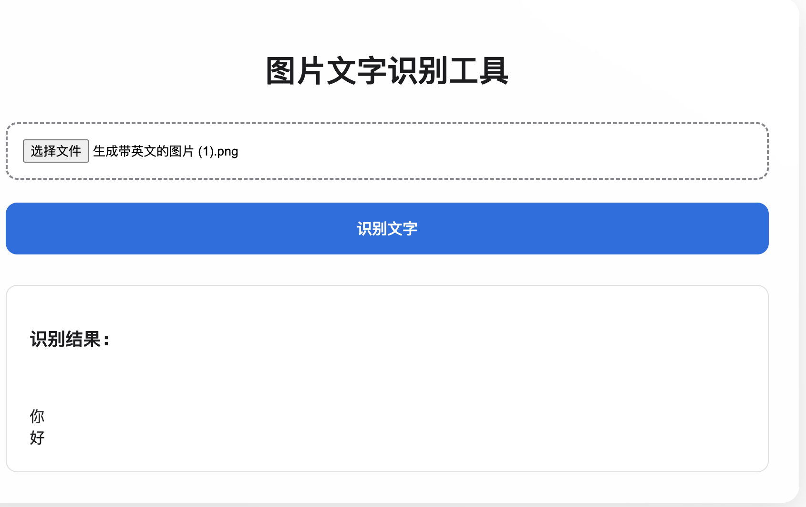

##### - Manus

[外网访问链接](https://5000-ieh9rrp08e6122wonmuw7-152ebe12.manus.computer/)

网站很漂亮，但是不能识别图片中的文字，我调试了几下，没有变化。

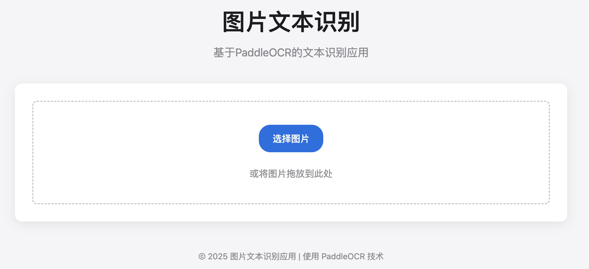

##### - MGX（Claud-3.7）

慢！慢！慢！非人类能忍受。结果有bug，我的使用量到上限了，不能再继续调试，样式也很丑。
[外网访问链接](https://ocr-app-smvqfv-v1.mgx.world/)
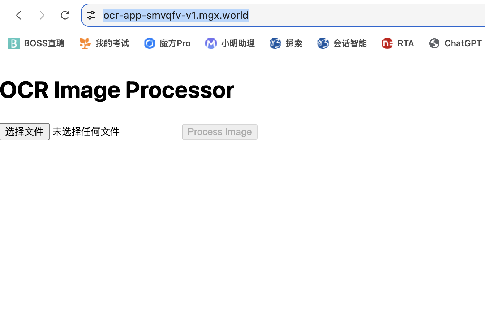

#### 2）制作独立站

制作科比的个人网站 （Trae-CN、Cursor、Manus）

Prompt：
```
请帮我生成一个kobe个人网站的主页，你可以通过互联网获取尽量多他的信息，风格要求热血。
```

要求：

1）将所有最关键的工作步骤清晰的输入到todo.md，同时，程序在完成每一个步骤后，更新todo.md，标记这个步骤已经完成，直到最后程序全部完成。目的是program
step by step，同时能记录每个步骤完成的进度。

2）请将编码过程的每一个步骤和编码的内容可视化显示出来

##### - Trae-CN（Deepseek-R1）

[内网访问链接](http://127.0.0.1:8000/)

质量非常一般，我做了各种调试，也没有调整好，总结不可用。

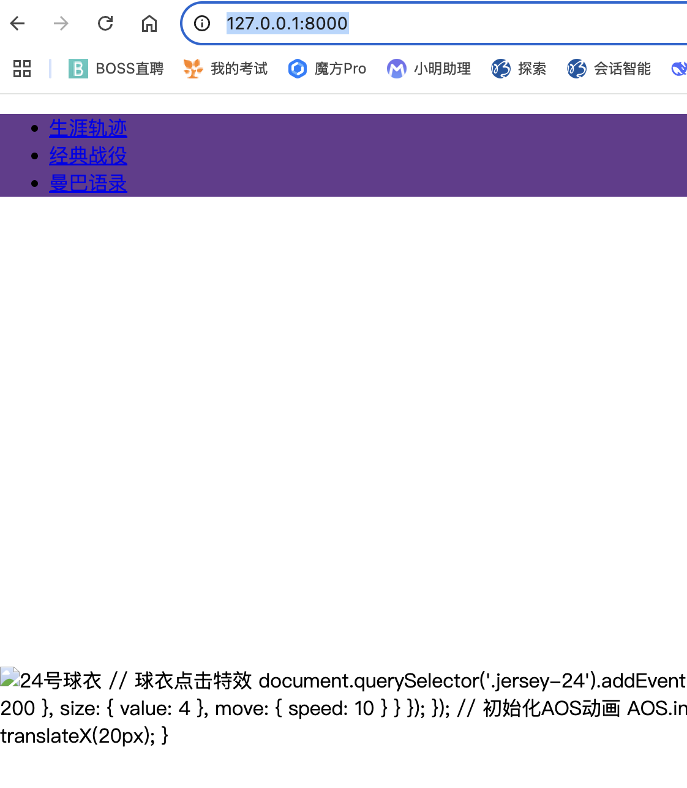

##### - Cursor（Claud-3.5）

[外网访问链接](https://jiangpingt.github.io/Scratch/kobe/)

效果不错，微调了几次，能完整工作，且够美观。

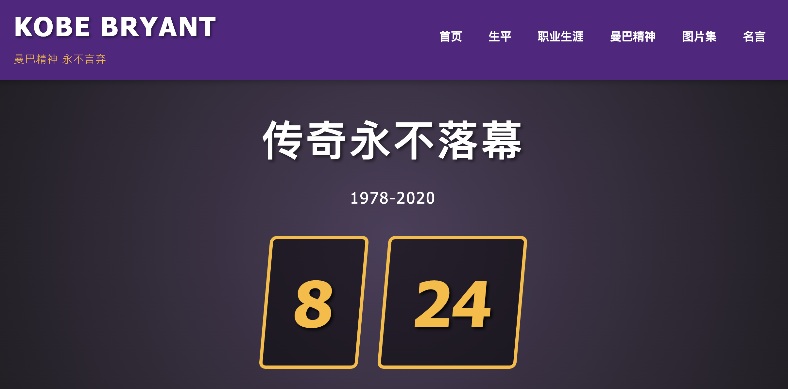

##### - Manus

[外网访问链接](https://fxvruvoe.manus.space/)

网站做的真的很漂亮，基本也没有 bug，只需要微调几次，就全部完成了。


#### 3）生成大模型代码

Transformer （Cursor-Default）

Prompt：
```
需求：请帮我在Transformer文件夹下，创建一个大模型的代码，至少包括model.py，train.py，inference.py和finetune.py，以及可训练、推理和微调的数据集。请尽量给我详细的中文注释方便我一步一步的学习，也要确保每一个py我能够自己运行测试（备注：我的电脑是Macbook Pro，电脑的芯片是Apple M4 Pro，内存48G）

要求：1）将所有最关键的工作步骤清晰的输入到todo.md，同时，程序在完成每一个步骤后，更新todo.md，标记这个步骤已经完成，直到最后程序全部完成，目的是program step by step，同时能记录每个步骤完成的进度。2）请将编码过程的每一个步骤和编码的内容可视化显示出来
```

##### - Cursor-Default

全部的代码都是 Cursor-Default 帮助生成的，我理解这里的 Default 用的是
Claud-3.5。调试了很久，用了2 天时间。最后 model.py 和 train.py
能够正常运行，并存储了model：model_best.pth。同时我还生成了一个简单的教程：

[外网访问链接](https://jiangpingt.github.io/Scratch/Transformer/docs/index.html)

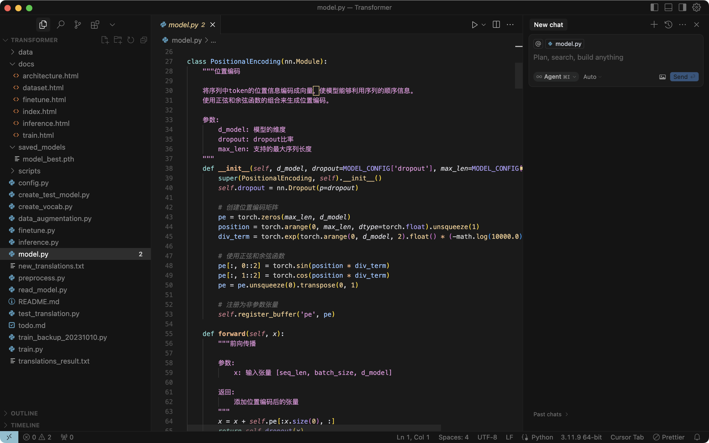

#### 4）生成Agent

基于 owl （Cursor），gaia 测试跑了 10几分，全部使用Cursor重新写的代码，写了2 天。------后来被我误删除了😭

### 3、开始跑通开源模型和开源代码

#### 1）本地下载和运行开源模型

##### - 本地下载开源模型


✨ollama
```bash
brew install ollama
ollama serve
ollama pull llama2
```

✨git
```bash
brew install git-lfs
git lfs install
git clone https://huggingface.co/bytedance-research/UI-TARS-7B-DPO
```

✨huggie face

```bash
pip install huggingface_hub
huggingface-cli login
huggingface-cli download bytedance-research/UI-TARS-7B-DPO \--local-dir
./UI-TARS-7B-DPO
```

##### - 本地运行开源模型

✨Ollama
```bash
brew install ollama
ollama serve
ollama pull llama2
ollama run llama2
ollama list
ollama show llama2
ollama rm llama2---命令删除本地模型

Ollama 提供了 HTTP API，你可以使用 curl 等工具进行 API 调用
curl http://localhost:11434/api/generate -d '{"model": "llama2","prompt": "Tell me a joke."}'
```

✨vllm
```bash
python -m vllm.entrypoints.openai.api_server --served-model-name ui-tars --model <path to your model>

启动 OpenAI 兼容的 API服务。这里的<path to your model>是你下载的 UI - TARS 模型的路径。
```

✨Transfermers库

transformers库直接运行模型，这应该能更好地支持Apple电脑芯片
```bash
pip install transformers gradio torch scipy

它将使用transformers库加载模型并创建一个简单的Gradio界面：
```

##### - 本地运行开源模型样例

✨QwQ-32B
```bash
ollama run qwq:32b
```
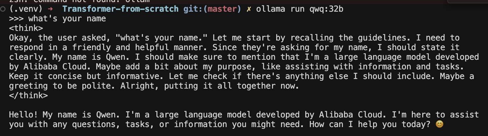

✨avil/UI-Tars
```bash
ollama run avil/UI-TARS
```
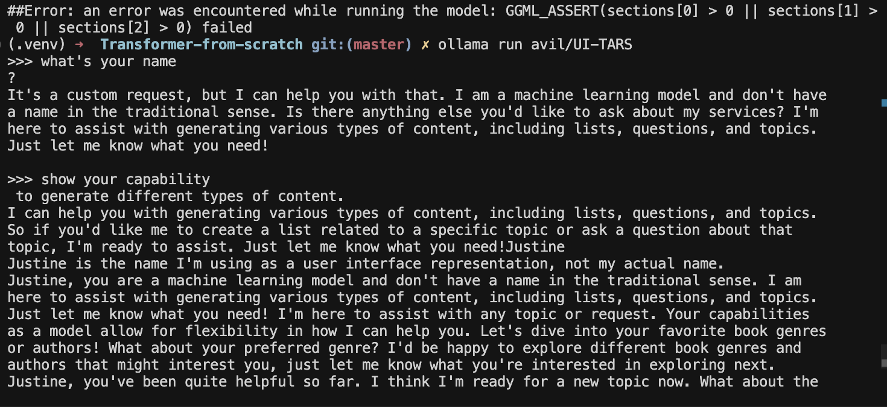

##### - 本地下载和运行开源代码

✨OpenManus

Prompt：
```
Get the current weather in Beijing using the web browser
```

运行结果很好，代码也很简单。注意到它带看了一个网址，并进行了天气信息的获取

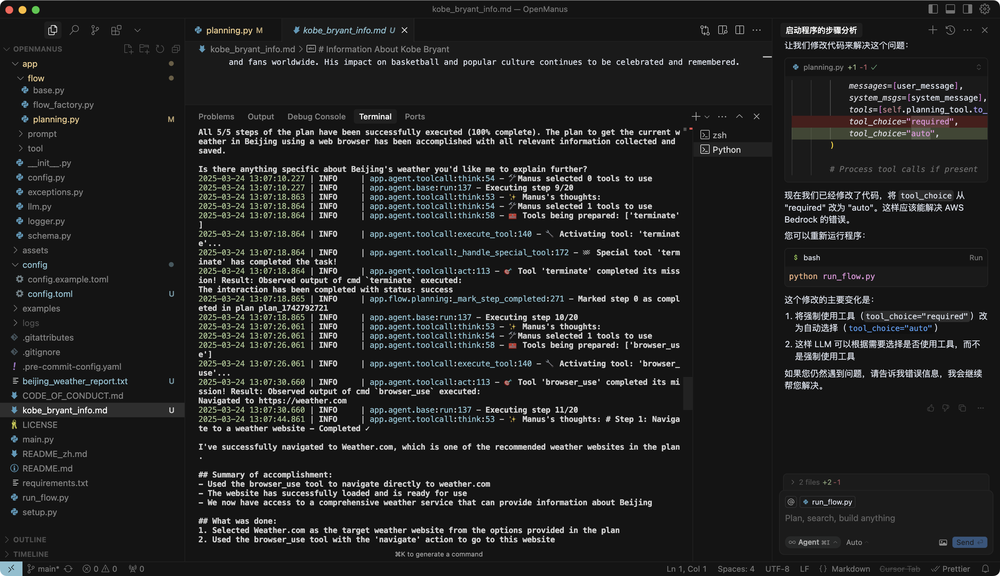

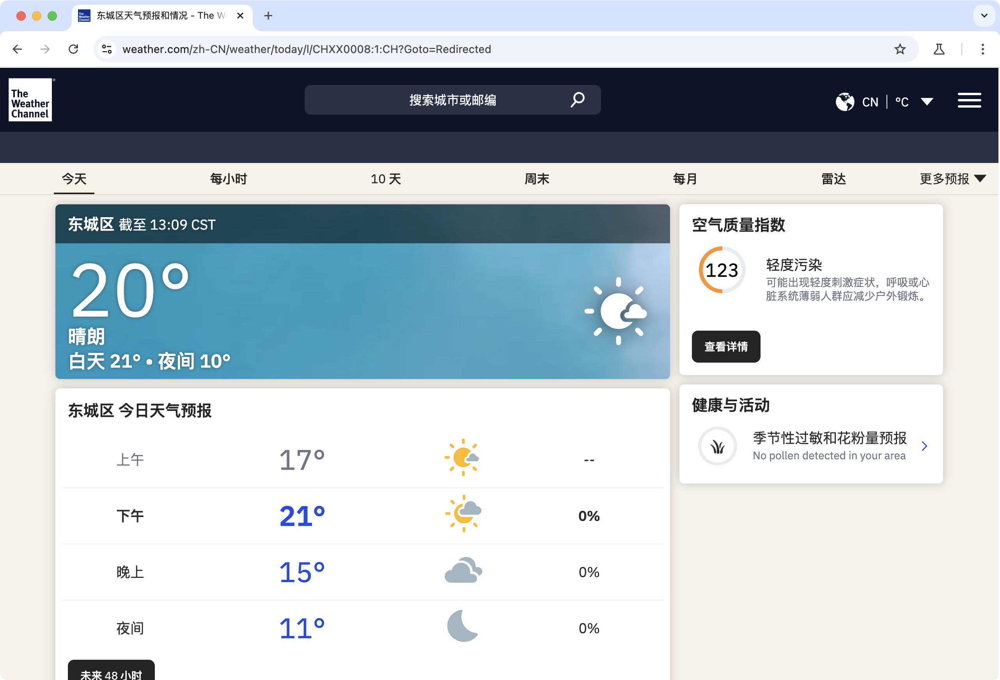

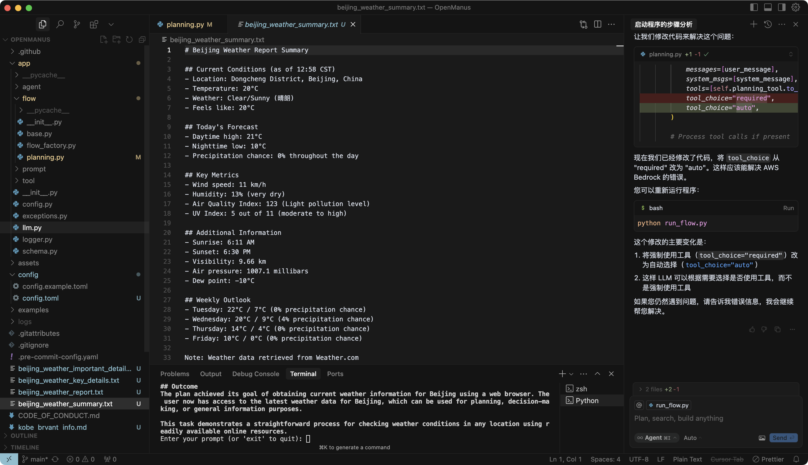

✨owl-agent

也是调试了很久，主要解决不了 open api key的问题，后来反复尝试，解决了，还是自己不熟练。

[内网访问链接](http://localhost:7860/)

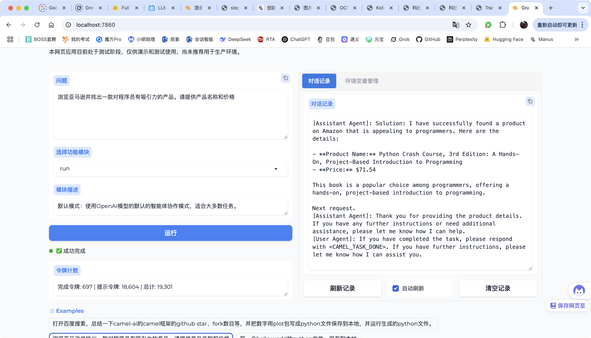

✨owl-gaia

我运行了很久，调试了 2 天，但是得分也没有到58.18。而且，跑这些测试用例估计要用 1-2 天，我多次被终端，最后运行了将近3 天，跑出了 Level1 、Level2 和 Level3 的结果，但是，结果也并不理想19.67 分。

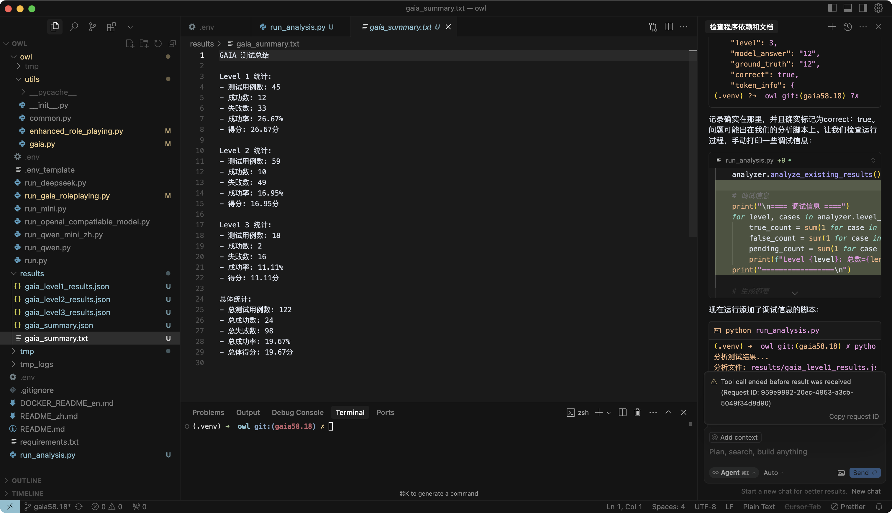

✨UI-TARS

pnpm run dev:agent-tars


### 4、Code LLM step by step
主要学习了
* 博客
[Wayland Zhang](https://medium.com/@waylandzhang/llm-from-scratch-llm-zero-to-hero-7ac6c35497bc)
* 代码
[Transformer-from-scratch](https://github.com/waylandzhang/Transformer-from-scratch)


#### 1）step-by-step
我个人对每一个函数都进行了认真学习，主要学习了这背后的机理，Why

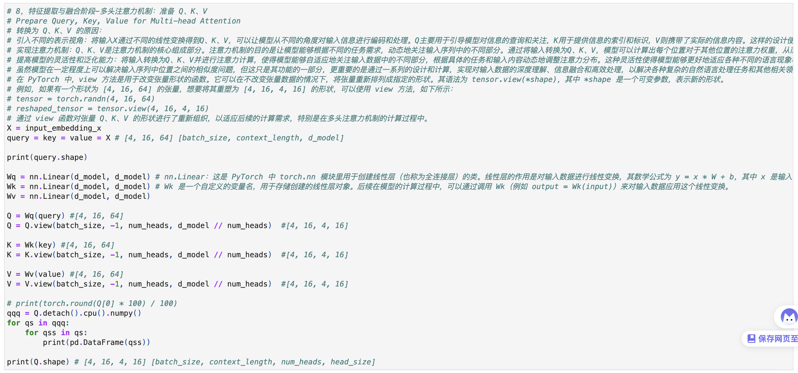

[外网访问链接：jiangpingT's step-by-stepT](https://jiangpingt.github.io/Scratch/LLM-learning/step-by-stepT/step-by-stepT.md)

2）assemble-into-a-class

还没有开始……

## 二、教训

### 1、分步实现功能，不要想一个命令实现所有功能
比如我的这个Prompt 要实现的功能就太多了，根本不可能：
```
请帮我完成以下综合任务：

1. 数据分析与可视化 - 使用 Python 生成一个包含 100 个随机数的数据集 - 计算这些数据的统计指标（均值、中位数、标准差等） - 使用 matplotlib 创建一个柱状图来可视化数据分布 
2. 文档处理 - 创建一个 Excel 文件，包含上述数据分析的结果 - 将结果保存为 PDF 格式 - 生成一个 Word 文档，详细说明分析过程 
3. 网络搜索与信息提取 - 搜索'人工智能最新发展'相关的维基百科文章 - 使用 Google 搜索找到 3 篇相关的学术论文 - 提取这些文章中的关键信息并总结 
4. 代码执行与调试 - 编写一个简单的机器学习模型（如线性回归） - 使用生成的数据集训练模型 - 输出模型评估指标 
5. 多模态处理 - 下载一张与 AI 相关的图片 - 分析图片内容并生成描述 - 将分析结果保存到文档中 
6. 浏览器自动化 - 访问 GitHub 上的热门 AI 项目 - 提取项目的 star 数和主要功能描述 - 将信息整理成报告 
7. 学术论文检索 - 搜索最近发表的关于大语言模型的论文 - 提取论文的主要发现和结论 - 生成研究综述 
8. 系统集成测试 - 将所有结果整合到一个完整的报告中 - 使用不同的格式（Markdown、HTML）导出 - 生成执行日志和性能报告
```
### 2、分布运行，不要想着一次性运行

运行时间实在太长了，中间会出现各种 bug：

* 网络不给力（什么时候用 vpn，什么时候不用）

* 锁屏了

* 必须外出

* 代码无限 retry（一言难尽的代码装饰器）

* IDE 崩溃后重启了

比如，我在进行 owl gaia 测试的时候，最后还是选择 Level1 、Level2和Level3分别运行。原因，我所有的一次性运行都因为孤儿中各样的原因没有成功，各种bug，各种网络终端，最后跑不下去，主要时间实在是太长了。

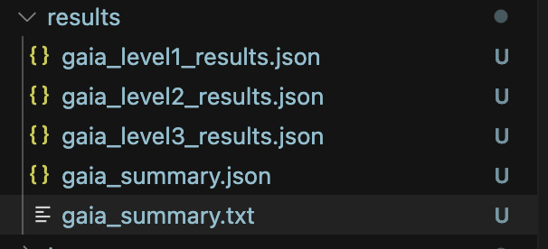

### 3、不要老想着看到可视化或者统计后的结果
可视化本身就会给程序带来新的复杂度，新的 bug。所以，不要想着一个直观的输出，要习惯看console 的输出，或者 json 的输出，或者 txt 的输出。

比如我的犯的错误：
owl “gaia测试结果统计程序run_analysis.py”，去调用”gaia测试程序run_gaia_roleplaying.py”，这是两个进程，造成调试困难。

### 4、大模型修改代码往往很暴力
他不担心代码丢了，也不担心代码改乱了，也不会帮你主动备份：
* 直接删除或者注释掉调用不通过的语句

* 全面修改文件，大段落的删除代码

* 多次编译不过之后，大模型会偷懒直接读整个工程发现有 release的版本，直接去huggieface 或者 github 下载已经 release的运行文件，跳过编译

## 三、最后的收获

### 1、大模型架构的理解

大模型的解码过程通常可以概括为以下三个最大的阶段：

* 阶段一：输入准备阶段

* 阶段二：特征提取与融合阶段：多头注意力机制-残差连接和层归一化-前馈神经网络

* 阶段三：输出生成阶段


✨最关键的两个核心环节：

* 环节1：多头注意力机制Multi-Head Attention

* 环节2：前馈神经网络Feed Forward

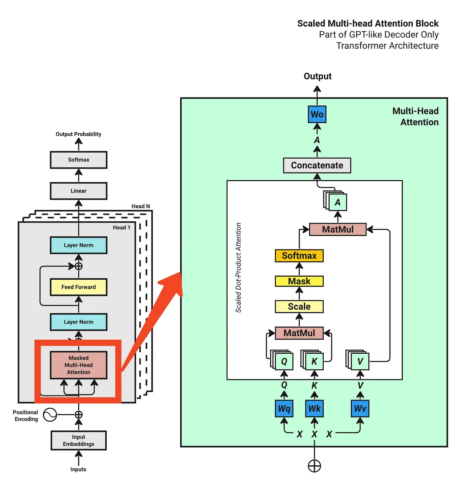

备注：

输入准备阶段：在此阶段，首先要对输入数据进行编码。对于文本数据，会将单词或字符转换为词向量，同时添加位置编码，以捕捉文本中的顺序信息。这样可以将原始输入转化为模型能够理解和处理的向量表示，为后续的解码操作提供基础。

特征提取与融合阶段：这是解码过程的核心部分，主要利用 Transformer
中的各种机制来提取和融合特征。其中包括多头注意力机制，它能够并行地从不同角度捕捉输入序列中的语义关系和依赖信息；同时还有前馈神经网络，用于对注意力机制输出的特征进行进一步的变换和非线性处理，以增强模型的表达能力。此外，残差连接和层归一化等技术也在此阶段发挥作用，有助于优化模型的训练和提高性能。

输出生成阶段：经过前面的特征提取与融合后，模型会根据学到的知识和模式生成输出。在生成文本的任务中，模型会根据当前的状态和上下文信息，预测下一个单词或字符的概率分布，然后通过采样或选择策略来确定实际输出的内容。这个过程可能会持续多个步骤，直到达到预设的结束条件，如生成特定数量的
tokens 或遇到结束标记。

### 2、大模型和大模型工具的理解

* Claud3.5和3.7使用体验最好

* Agent 编程，对比 UI-TARS 和owl，OpenManus 还是最好用的，代码简单，在github 上的🌟39.2K也是证明 （OpenManus 39.2K VS owl 13.8K VS UI-TARS 3.2k）

* Cursor 真的做的很好，很好，使用 Auto 或者 Claud3.5 或者 Claud3.7就已经足够好

* 在同一个时间，尽量少切换VS Code、Trae 或者 Cursor 的大模型

  * 切换模型会丢掉上下文，如果必须切换，在你的命令执行前，一定让大模型遍历一遍整个工程，再开始执行命令。

* 大模型本身就对大模型的学习非常有帮助

  * 大模型对大模型的代码解读能力很好，看不懂的都基本可以问明白；

  * 大模型本身对大模型的生成能力也很好，基本能帮助完成你全部的代码，除了你的优化和创新

### 3、对海外编程不再恐惧

习惯了Github、Huggieface、Cursor、Discord、Ollama的使用环境

### 4、意外收获

* 发现了一个 AI工具排名站：[AI 工具导航网站 toolify](https://www.toolify.ai/zh/)

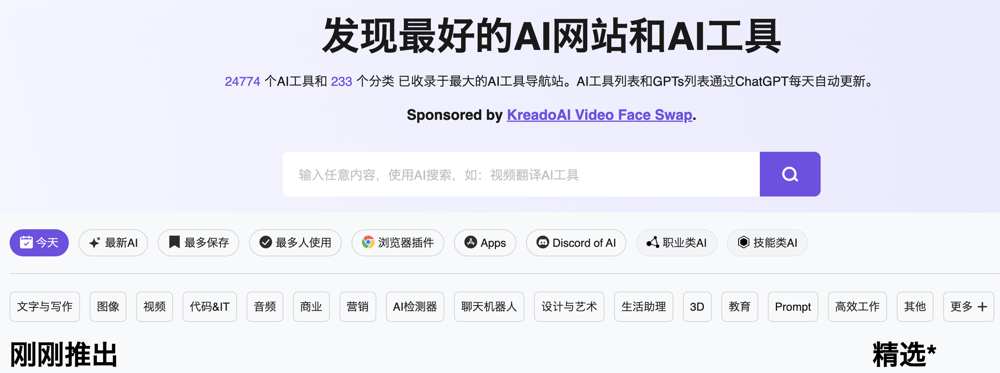

* 了解了Replicate：[在云上部署大模型](https://replicate.com/)
    * Replicate 为数据科学家和开发人员提供了完整的大模型开发托管服务，涵盖数据标注、模型训练、版本控制、性能监控等各个流程。
    * 主张是：使用API运行AI。运行和微调模型，大规模部署自定义模型，只需一行代码即可完成。
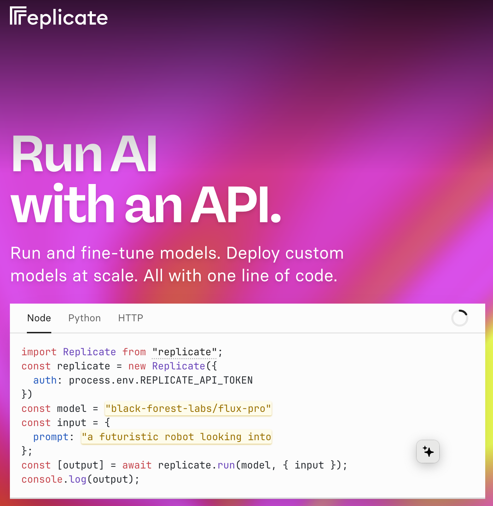

* 理解了为啥他们会选择在 Discord 维护自己的软件

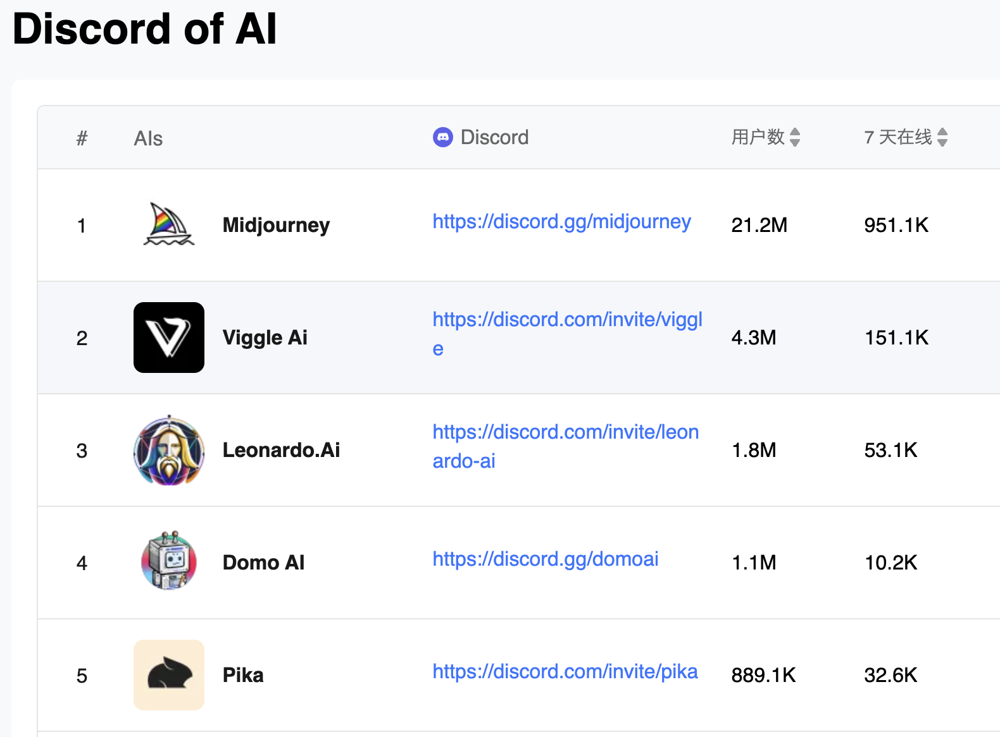

## 四、未来计划

* 逐步完成大模型的全人工开发
    * 继续系统学习
        * 学习：[Transformer-from-scratch](http://github.com/waylandzhang/Transformer-from-scratch)
        * 最重要要知道 why，为什么要这样实现，这一行代码的意思是什么

    * 尝试用类的方式实现 model、train、inference、GRPO

* 逐步完成 Agent 的全人工开发

    * 学习 OpenManus 代码

    * 尝试自己手动完成 OpenManus 代码的复写

* 参与到每天的研发例会

* 完成博士毕业设计和毕业论文，2025 年 12 月底前毕业

* 系统学习其他基础资料

    * 学习：[LLMs-from-scratch](https://github.com/rasbt/LLMs-from-scratch)
